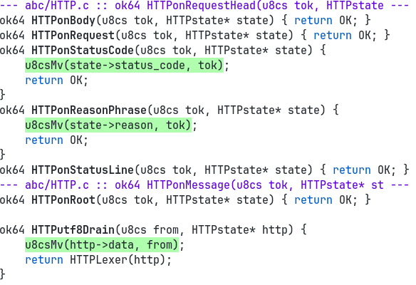

# `spot` — git repo code multitool

**spot** is a repo multitool leveraging its understanding of syntax
and an inverted trigram index to do many of everyday repo tasks:

 1. *cat* with style (syntax highlighted)
 2. code *snippet* search (uses an index)
 3. *grep* (uses an index)
 4. *regex* search (uses an index)
 5. token-level *diff* tool
 6. token-level 3-way *merge* tool
 7. repo indexer (complete or incremental)

## Examples

Index a repo on 8 cores:

    $ spot --fork 8
    ...
    spot: compacting all runs
    spot: done

Scan for function invocations:

    $ spot -s 'u8csMv(A)' .c

## Usage

    spot file.c                       colorful cat (syntax highlight)

    spot -i | spot --index            full reindex (single process)
    spot                              incremental update (or reindex)
    spot --fork N                     parallel reindex on N cores
    spot --hook                       same as bare `spot`

    spot -s "return 0;" .c            SPOT search: find pattern in C files
    spot -s "ok64 o = OK;" .c         SPOT search: find exact declaration
    spot -s "f(x,y)" -r "f(y,x)" .c   SPOT search + replace

    spot -g "TODO" .c                 grep: substring search (incl. comments)
    spot -g "TODO" -C 0 .c            grep: match line only, no context

    spot -p "u\d+sFeed" .c            regex grep (Thompson NFA)
    spot -p "regex" -C 0 .c           regex grep, match line only

    spot --diff old new               token-level colored diff
    spot --gitdiff                    git external diff driver

    spot --merge base ours theirs     token-level 3-way merge (stdout)
    spot --merge B O T -o out         merge to file

Trailing args starting with `.` are extension filters (required for `-s`,
optional for `-g`). The extension selects the tokenizer and the subset
of the files to look into (e.g. `.c` matches `**/*.c` and `**/*.h`).

### Snippet search

SPOT matches structurally, not textually — whitespace and formatting
differences are ignored. Lowercase placeholders (`a`–`z`) bind to a
single token, so `ok64 o = OK;` also matches `ok64 ret = OK;`.
Uppercase placeholders (`A`–`Z`) match any block of code, including
nested brackets — use these for multi-token arguments in function
calls. Two spaces (a gap) skip any token sequence.

Results are syntax-highlighted with context lines and hunk headers:

    $ spot -s "ok64 o = OK;" .c
    --- abc/BIN.h :: ok64 BINu8csFeed(Bu8 buf, u8csc data) ---
        ok64 o = OK;
        ...
    --- abc/FILE.c :: ok64 FILEMapRO(u8bp *out, path8cg path) ---
        ok64 o = OK;
        ...

Rename a macro call to a function (uppercase placeholders match
multi-token arguments including nested brackets):

    $ spot -s "TOK_VAL(A,B,C,D)" -r "tok32Val(A,B,C,D)" .c .h

Rename a single-token function (lowercase matches one token):

    $ spot -s "OldFunc(x)" -r "NewFunc(x)" .c

Look for a typical `malloc` call pattern:

    $ spot -s 'malloc(a*B);' .c

Standardize `malloc()` argument order:

    $ spot -s 'malloc(sizeof(a)*B);' -r 'malloc(B*sizeof(a));' .c

### Grep (indexed)

Grep mode does substring search across all token leaves including 
comments. Resulting hunks are syntax-highlighted with context.

Find TODOs in comments:

    $ spot -g "TODO" .c

Search all parseable files (omit the extension):

    $ spot -g "CAPOTriChar"

Control context lines with `-C N`:

    $ spot -g "TODO" -C 0 .c      # match line only
    $ spot -g "TODO" -C 1 .c      # 1 line above and below

### Regex grep

Regex grep (`-p`) uses a Thompson NFA engine (`abc/NFA.h`) for matching.
Supports `.` `*` `+` `?` `|` `()` `[]` `\d` `\w` `\s` `{n,m}`.
Literal substrings are extracted from the regex for trigram index
filtering (Russ Cox approach), so index speedup works when the pattern
contains literal runs of 3+ characters.

Find functions matching a naming pattern:

    $ spot -p 'u\d+sFeed' .c

Search for alternative names:

    $ spot -p 'tok32(Val|Tag|Pack)' .c

Regex grep with custom context width:

    $ spot -p 'CAPO\w+Grep' -C 1 .c

### Diff and merge

Token-level diff highlights changes at the token granularity, not lines:

    $ spot --diff old.c new.c

Three-way merge works as a git merge driver:

    $ spot --merge base.c ours.c theirs.c -o merged.c

## Git integration

`.gitattributes` (project root):

    *.c  diff=spot merge=spot
    *.h  diff=spot merge=spot

`.git/config` (or `git config`):

    git config diff.spot.command "spot --gitdiff"
    git config merge.spot.name "spot token merge"
    git config merge.spot.driver "spot --merge %O %A %B -o %A"

Post-commit hook (incremental reindex):

    echo '#!/bin/sh
    spot --hook' > .git/hooks/post-commit
    chmod +x .git/hooks/post-commit

## How it works

**Indexing**: Source files are tokenized based on the file extension, 
trigrams are packed into index arrays in `.git/spot/*.idx`.
`--fork N` stripes files across N workers.

**SPOT mode**: extracts trigrams from the needle text, seeks each in the
MSET index, intersects path hash sets to narrow candidates, then
tokenizes each candidate file and runs flat token pattern matching
(SPOT) to find structural matches. Shows syntax-highlighted context
with function headers.

**Grep mode**: same trigram filtering, but walks all token leaves
including comments and does plain substring matching. Shows
syntax-highlighted context around each hit (default 3 lines,
adjustable with `-C`) with function headers.

**Diff** and **merge**: tokenizes both files, runs LCS-based diff on the token
streams, outputs syntax-highlighted results with function headers at
hunk boundaries. Merge extends this to three-way with conflict markers.

##  Credits

The idea of repo trigram indexing is borrowed from [Russ Cox][c].
The initial version of the tool used [tree-sitter][t] grammars, 
later changed to [ragel-based][r] lexers for performance reasons.

[c]: https://swtch.com/~rsc/regexp/regexp4.html
[r]: https://www.colm.net/open-source/ragel/
[t]: https://tree-sitter.github.io/tree-sitter/
